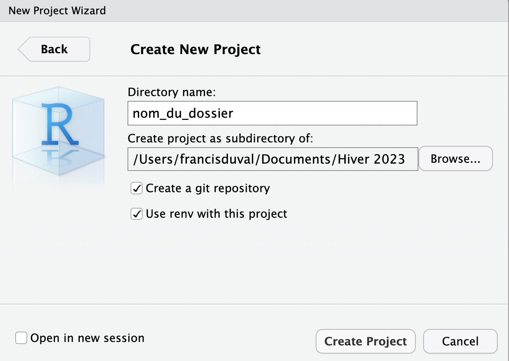
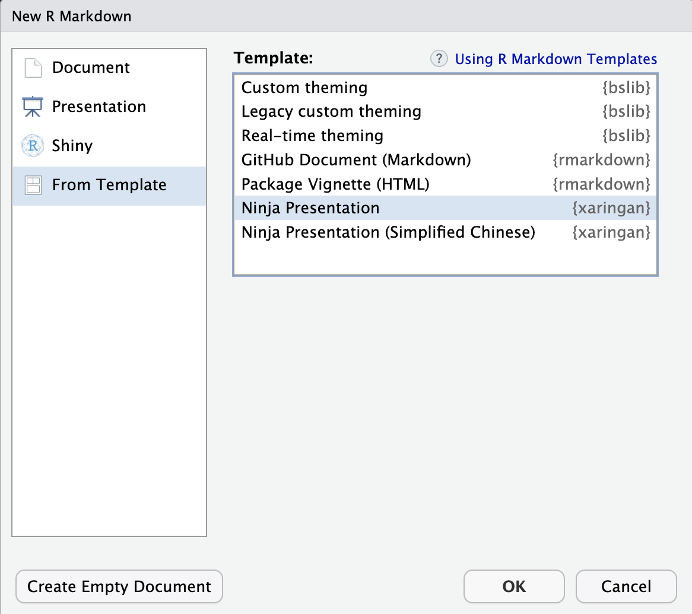
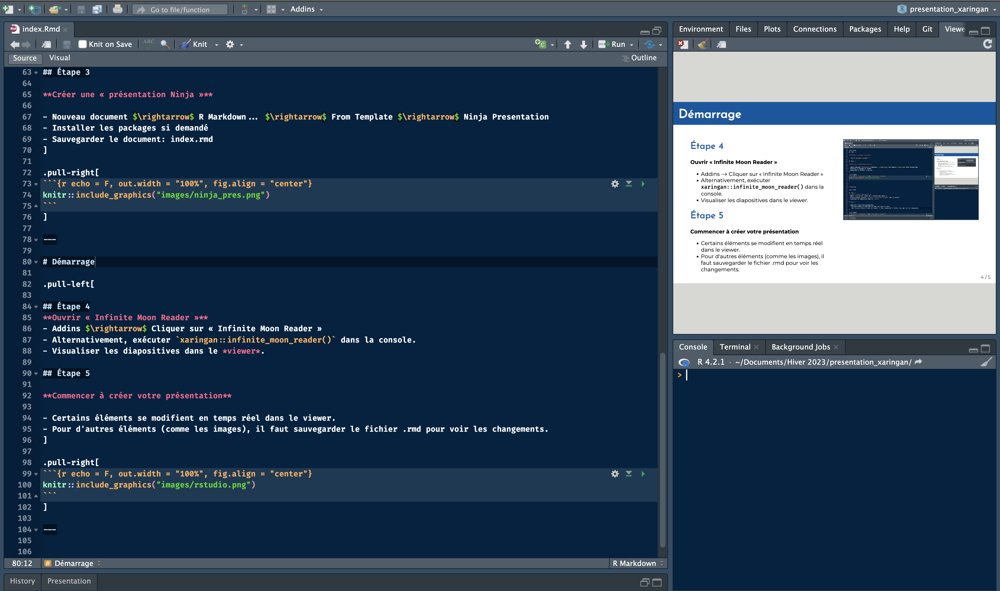
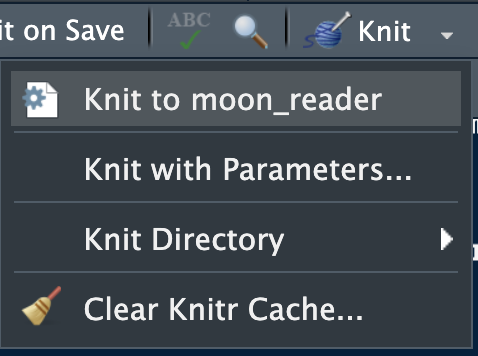

class: title-slide
background-image: url(images/logo_chaire.jpg), url(images/background.jpg)
background-size: 30%, cover
background-position: 98% 98%, center

.titre-page-titre[Optimisez vos diapositives de présentation avec xaringan]
<br />
.sous-titre-page-titre[Séminaire de la Chaire CARA]
<br />
<br />
***
<br />
<br />
.sous-sous-titre-page-titre[.mon-style-bleu[par] Francis Duval <br /> .mon-style-bleu[à] l'Université du Québec à Montréal <br /> .mon-style-bleu[le] 22 mars 2023]

---

# Qu'est-ce que xaringan?

.left-column[
<br><br><br><br>
```{r echo = F, out.width = "90%", fig.align = "center"}
knitr::include_graphics("images/xaringan.png")
```
]

.right-column[
<br><br><br><br>
.bleu-gros[1) RMarkdown avec fonctionnalités supplémentaires]
<br><br><br>
.bleu-gros[2) *Render* les diapositives] $\boldsymbol{\rightarrow}$ .bleu-gros[page web HTML]
<br><br><br>
.bleu-gros[3) Styliser avec CSS]
]

---

# Démarrage

## Étape 1

**Se créer un projet R**

.pull-left[
```{r echo = F, out.width = "100%", fig.align = "left"}

```
]

.pull-right[
- Cocher « Create a git repository » et « Use renv with this project » (recommandé)
]

---

# Démarrage

.pull-left[
## Étape 2

**Installer le package `xaringan`**

- `install.packages("xaringan")`

## Étape 3

**Créer une « présentation Ninja »**

- Nouveau document $\rightarrow$ R Markdown... $\rightarrow$ From Template $\rightarrow$ Ninja Presentation
- Installer les packages si demandé
- Sauvegarder le document: index.rmd
]

.pull-right[
```{r echo = F, out.width = "100%", fig.align = "center"}

```
]

---

# Démarrage

.pull-left[

## Étape 4
**Ouvrir « Infinite Moon Reader »**
- Addins $\rightarrow$ Cliquer sur « Infinite Moon Reader »
- Alternativement, exécuter `xaringan::infinite_moon_reader()` dans la console.
- Visualiser les diapositives dans le *viewer*.

## Étape 5

**Commencer à créer votre présentation**

- Certains éléments se modifient en temps réel dans le viewer.
- Pour d'autres éléments (comme les images), il faut sauvegarder le fichier .rmd pour voir les changements.
]

.pull-right[
```{r echo = F, out.width = "100%", fig.align = "center"}

```
]

---

# Thème de la Chaire

**Pour avoir le thème de la Chaire, il vous faudra:**

1) Ajouter le fichier de style `theme_cara.css` à votre dossier projet, que vous pouvez trouver ici: [github.com/francisduval/xaringan_template_cara](https://github.com/francisduval/xaringan_template_cara)

2) Changer le YAML pour ceci:
```
    title: "Titre"
    subtitle: "Sous-titre"
    author: "Prénom, Nom"
    institute: "Université du Québec à Montréal"
    date: "`r Sys.Date()`"
    output:
      xaringan::moon_reader:
        seal: false
        css: "theme_cara.css"
        lib_dir: libs
        nature:
          ratio: "16:9"
          highlightStyle: github
          highlightLines: true
          countIncrementalSlides: false
```

---

# Thème de la Chaire

**Pour avoir le thème de la Chaire, il vous faudra:**

3) Créer un nouveau dossier « images » dans votre dossier projet et y déposer les 2 images nécessaires pour la page-titre, disponibles ici: [github.com/francisduval/xaringan_template_cara/tree/master/images](https://github.com/francisduval/xaringan_template_cara/tree/master/images)
  - logo_chaire.jpg
  - background.jpg

---

# Commandes RMarkdown

### Toutes les commandes RMarkdown fonctionnent en xaringan

--- 

.pull-left[
<span style="text-decoration: underline">Titres</span>
## Titre niveau 2
### Titre niveau 3

--- 

<span style="text-decoration: underline">Liste</span>
- **Texte en gras** 
- *Texte en italique*
- Saut de ligne: `<br>`
- Espace: `$~~$` (cette commande fait 2 espaces)
- [Lien](https://learntheweb.courses/topics/markdown-yaml-cheat-sheet/)
- ~~Barré~~
  - Sous-item
]

.pull-right[
<span style="text-decoration: underline">Liste numérotée</span>
1. Code R non-évalué: \``r knitr::inline_expr("mean(rnorm(10))")`\`
2. Code R évalué: `r mean(rnorm(10))`
3. Équation: $\frac{d}{{dx}}\tan x = \sec ^2 x$
4. Bloc *align* en LaTeX:
\begin{align*}
  x &= x\\
  &= x + y
\end{align*}

--- 

<span style="text-decoration: underline">Table simple</span>

Titre 1 | Titre 2
------------- | -------------
Cellule 1 | Cellule 2
Cellule 3 | Cellule 4
]

---

# Images

**2 manières d'inclure des images**

- Image d'arrière-plan (à placer au tout début de la diapositive):

```
background-image: url(images/wallpaper.jpg)
background-size: 100%
background-position: cover
```

- Image avec `knitr` (à placer dans un bloc de code `R`):
````
```{r echo = T, out.width = "60%", fig.align = "center"}`r ''`

```
````

Évidemment, dans les 2 cas, il y a plein d'options pour changer l'apparence de l'image (dimensions, position, opacité, etc.)

---

background-image: url(images/wallpaper.jpg)
background-size: 100%
background-position: cover

# Image d'arrière plan

<br><br><br><br><br><br>
**.white[C'est une image d'arrière-plan, donc on peut écrire par-dessus.]**

---

# Image avec knitr

```{r echo = T, out.width = "40%", fig.align = "center", fig.cap = "Un Snorlax qui rampe"}

```

**L'image peut également être un GIF!**

---

# Table de données avec kableExtra

```{r}
kableExtra::kable(head(iris), format = "html")
```

Évidemment, il y a plein d'options pour personnaliser l'apparence dans la librairie `kableExtra`.

---

# Table interactive avec DT

```{r}
DT::datatable(mtcars, fillContainer = F, options = list(pageLength = 6))
```

---

$$\DeclareMathOperator*{\argmin}{argmin}$$

# Macros LaTeX

Exemple: on veut utiliser l'opérateur *argmin* dans une équation. Ce n'est pas dans les opérateurs de base en LaTeX. Il faut donc déclarer l'opérateur entre 2 double symboles de $, n'importe où dans le fichier .Rmd:

```
$$\DeclareMathOperator*{\argmin}{argmin}$$
```

On peut ensuite l'utiliser:

\begin{align}
  \boldsymbol{w}^* &= \argmin_\boldsymbol{w} \frac{1}{n}\sum_{i=1}^n \ell(y, \widehat{y})\\
  &= \argmin_\boldsymbol{w} \frac{1}{n}\sum_{i=1}^n \ell(y, f(\boldsymbol{x}_i; \boldsymbol{w}))\\
  &= \argmin_\boldsymbol{w} J(\boldsymbol{w})
\end{align}

---

# Panelsets

```{r xaringan-panelset, echo = F}
xaringanExtra::use_panelset()
```

```{r echo=FALSE}
xaringanExtra::style_panelset_tabs(
  active_foreground = "#0051BA",
  hover_foreground = "#d22",
  font_family = "Roboto"
)
```
Possible de personnaliser l'apparence avec `xaringanExtra::style_panelset()`.

.panelset[
.panel[.panel-name[Instructions]
Pour pouvoir faire des panneaux, il faut avoir ce bloc de code n'importe où dans votre fichier .Rmd:

````
```{r xaringan-panelset, echo = F}`r ''`
xaringanExtra::use_panelset()
```
````

]
.panel[.panel-name[Code]
```r
plot(mtcars$hp, mtcars$mpg)
```
]
.panel[.panel-name[Output]
```{r, echo = F, out.width = "40%", fig.align = "center"}
plot(mtcars$hp, mtcars$mpg)
```
]
]

---

# Panelsets

.panelset.sideways[
.panel[.panel-name[.bleu-gras[Code]]
```r
plot(mtcars$hp, mtcars$mpg)
plot(mtcars$disp, mtcars$mpg)
plot(mtcars$drat, mtcars$mpg)
plot(mtcars$qsec, mtcars$mpg)
```
]
.panel[.panel-name[mpg vs hp]
```{r, echo = F, out.width = "100%", fig.align = "center"}
plot(mtcars$hp, mtcars$mpg)
```
]
.panel[.panel-name[mpg vs disp]
```{r, echo = F, out.width = "100%", fig.align = "center"}
plot(mtcars$disp, mtcars$mpg)
```
]
.panel[.panel-name[mpg vs drat]
```{r, echo = F, out.width = "100%", fig.align = "center"}
plot(mtcars$drat, mtcars$mpg)
```
]
.panel[.panel-name[mpg vs qsec]
```{r, echo = F, out.width = "100%", fig.align = "center"}
plot(mtcars$qsec, mtcars$mpg)
```
]
]

---

```{r xaringanExtra-scribble, echo = F}
xaringanExtra::use_scribble()
```

# Scribble

- Simplement inclure ce bout de code:

````
```{r xaringanExtra-scribble, echo = F}`r ''`
xaringanExtra::use_scribble()
```
````

- On peut ensuite dessiner en temps réel sur les diapositives en appuyant sur « s ».
- Pour désactiver Scribble pour une diapositive en particulier: `class: no-scribble` au tout début de la diapositive.

---

```{r xaringan-tile-view, echo = FALSE}
xaringanExtra::use_tile_view()
```

# Overview

- Inclure ce bloc de code dans votre présentation:

````
```{r xaringan-tile-view, echo = FALSE}`r ''`
xaringanExtra::use_tile_view()
```
````

- Vous pouvez ensuite visualiser un « overview » de vos diapositives en appuyant sur « o ».

---

# Diapositive avec notes

- Mettre 3 points d'interrogation (`???`) pour séparer le contenu de la diapositive des notes.
- Voici l'anatomie d'une diapositive avec notes:

```
---

# Titre

Contenu

???

Écrire les notes ici.

---

```

- Pour voir les notes, simplement appuyer sur « p ».
- Ça peut être d'une grande utilité lorsqu'on pratique la présentation.
- Les notes fonctionnent dans le *viewer* et dans un HTML, mais pas dans un PDF.

???

$$\DeclareMathOperator*{\argmin}{argmin}$$
- Note 1
- Note 2
- Équation: $E = mc^2$
- Bloc *align*:
\begin{align}
  \boldsymbol{w}^* &= \argmin_\boldsymbol{w} \frac{1}{n}\sum_{i=1}^n \ell(y, \widehat{y})\\
  &= \argmin_\boldsymbol{w} \frac{1}{n}\sum_{i=1}^n \ell(y, f(\boldsymbol{x}_i; \boldsymbol{w}))\\
  &= \argmin_\boldsymbol{w} J(\boldsymbol{w})
\end{align}

---

# Intégration de vidéos YouTube

**Vous pouvez facilement intégrer des vidéos dans une présentation xaringan. A titre d'exemple, voici les étapes à suivre pour intégrer des vidéos YouTube :**

1. Sur un ordinateur, accédez à la vidéo YouTube que vous souhaitez intégrer.
2. Sous la vidéo, cliquez sur SHARE
3. Cliquez sur Intégrer.
4. Dans la boîte qui s'affiche, copiez le code HTML.
5. Collez le code dans votre document xaringan.

.center[
<iframe width="560" height="300" src="https://www.youtube.com/embed/tPikgFoboBg" title="YouTube video player" frameborder="0" allow="accelerometer; autoplay; clipboard-write; encrypted-media; gyroscope; picture-in-picture; web-share" allowfullscreen></iframe>
]

---

class: center, top, inverse

# Classes de diapositives 

**Une diapositive peut avoir des propriétés, notamment `class` et `background-image`.**<br><br>
**Les propriétés doivent être écrites au début de la diapositive**<br><br>

.left[
- `left`, `center`, et `right` pour l'alignement horizontal de tous les éléments sur la diapositive.
- `top`, `middle`, et `bottom` peuvent être utilisés pour l'alignement vertical.
- `inverse` permet d'utiliser les couleurs « inverses ».
- Évidemment, les couleurs de la classe inverse peuvent être définies dans le fichier css.
]

**Voici l'anatomie de cette slide:**

```
---
class: center, top, inverse

# Classes de diapositives 

Contenu

---
```

---

# Classes de contenu

- Vous pouvez attribuer des classes à n'importe quel élément d'une diapositive.
- La syntaxe est `.nomdelaclasse[contenu]`.
- Il est possible de styliser n'importe quel élément de votre présentation à l'aide de CSS.
  - Voici un site Internet qui semble intéressant pour générer du code CSS: [https://css-generator.netlify.app](https://css-generator.netlify.app)
- Il y a quelques classes « built-in »:
  - .left[`.left[]`]
  - .center[`.center[]`]
  - .right[`.right[]`]
- Exemple de classe personnalisée qui colore le texte en blanc (à mettre dans le fichier css):
```
.blanc {
  color: white;
}
```

**Exercice: à l'aide du [générateur de CSS](https://css-generator.netlify.app), créer une classe .maclass[] qui sert à écrire du texte blanc, sur un fond bleu et avec une bordure noire.**

.maclasse[Voici le résultat]

---

# `.pull-left[]` et `.pull-right[]`

Permet de séparer la diapositive en 2:

.pull-left[
**Éléments à gauche**

Lorem Ipsum is simply dummy text of the printing and typesetting industry. Lorem Ipsum has been the industry's standard dummy text ever since the 1500s, when an unknown...
]

.pull-right[
**Éléments à droite**

Contrary to popular belief, Lorem Ipsum is not simply random text. It has roots in a piece of classical Latin literature from 45 BC, making it over 2000 years old. Richard McClintock...
]

Anatomie de la diapositive:

```
---

# Titre

.pull-left[
Contenu à gauche
]

.pull-right[
Contenu à droite
]

---
```

---

# `.left-column[]` et `.right-column[]`

Même chose que `.pull-left[]` et `.pull-right[]`, sauf qu'au lieu d'avoir une séparation 50/50, on a une séparation 25/75:

.left-column[

]

.right-column[
**Éléments à droite**

Contrary to popular belief, Lorem Ipsum is not simply random text. It has roots in a piece of classical Latin literature from 45 BC, making it over 2000 years old. Richard McClintock...

- Évidemment, avec CSS, on peut définir n'importe quel « layout ».
]

---

# xaringanthemer

- `xaringanthemer` est une librairie qui permet de styliser les diapositives.
- En fait, la plupart des fonctions de cette librairie servent à générer du code CSS.

Le bloc de code suivant sauvegarde un fichier .css (appelé par défaut `xaringan-themer.css`) avec l'information pour styliser une présentation `xaringan`:
```{r, eval = FALSE}
style_xaringan(
  text_color = "blue",
  inverse_background_color = "#31b09e",
  inverse_text_color = "red"
)
```

Donc c'est une librairie qui peut être utile pour générer du code CSS (plutôt que de coder à partir de rien).

---

# Exporter sa présentation

.left-column[
```{r echo = F, out.width = "100%", fig.align = "center", fig.cap = "Knit to moon_reader"}

```
]

.right-column[
- Knit -> Knit to moon_reader permet d'obtenir un fichier HTML des diapositives.
- Or, ce fichier HTML n'est pas « self-contained », c'est-à-dire qu'il peut seulement être ouvrir dans son contexte (ici, le dossier projet).

#### 1) Option 1: en faire un site internet avec GitHub pages

- « Pusher » vos modifications sur un repository GitHub
- Aller dans « settings », puis sur l'onglet « Pages ».
- Choisir la branche à publier (probablement « master »): appuyer sur « Save ».
- L'addresse de la page web créée apparaitra (peut prendre quelques minutes).
- Noter que votre repository doit être public et qu'il doit contenir un fichier nommé `index.html`.
  
#### 2) Option 2: en faire un fichier PDF

- Cette [page web](https://www.garrickadenbuie.com/blog/print-xaringan-chromote/) explique bien comment procéder. Noter que plusieurs fonctionnalités ne sont pas prises en charge par les fichiers PDF. xaringan est plutôt fait pour créer des pages HTML.
]

---

# GitHub pages

```{r echo = F, out.width = "80%", fig.align = "center"}
knitr::include_graphics("images/github_pages.gif")
```

---

# Autres infos utiles

- Ajouter un logo à toutes les slides: [https://pkg.garrickadenbuie.com/xaringanExtra/#/logo](https://pkg.garrickadenbuie.com/xaringanExtra/#/logo)
- Diapositives modifiables en temps réel: [https://github.com/gadenbuie/xaringanExtra#-editable](https://github.com/gadenbuie/xaringanExtra#-editable)
- Animation lors des changements de diapositives:
  - [https://github.com/gadenbuie/xaringanExtra#-animatecss](https://github.com/gadenbuie/xaringanExtra#-animatecss)
- Vidéos sur xaringan:
  - [https://www.youtube.com/watch?v=FHy6NseH8yk&t=4378s](https://www.youtube.com/watch?v=FHy6NseH8yk&t=4378s)
  - [https://www.youtube.com/watch?v=RPFh3y9UAX4&t=5865s](https://www.youtube.com/watch?v=RPFh3y9UAX4&t=5865s)
  - [https://www.youtube.com/watch?v=3n9nASHg9gc&t=1935s](https://www.youtube.com/watch?v=3n9nASHg9gc&t=1935s)
- Etc.
